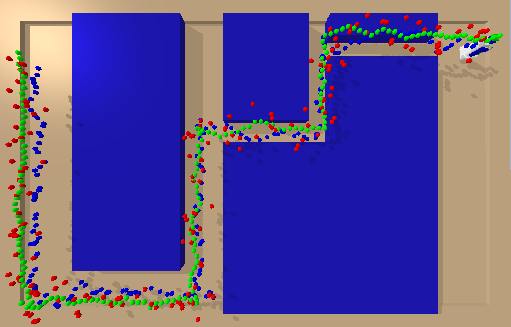

# EECS 498 Algorithmic Robotics Final Project
Final project for EECS 498 Introduction to Algorithmic Robotics, Fall 2021, University of Michigan

> Author: Jiayi Pan, Changyuan Qiu (equal contributions)

> See the full project report: [Comparision and Analysis of Kalman Filter and Particle Filter in Robot Localization](https://github.com/Jiayi-Pan/Bot-Localization/blob/master/EECS_498_Algorithmic_Robotics_Final_Project___Project_Report.pdf)




In this project, we introduced, compared and analyzed two robot localization algorithms: Kalman Filter and Particle Filter.
Extensive experiments were conducted under a curated simulation environment which covers scenarios including PR2 robot
moving forward in a spacious environment, turning around, and moving in corridors with different widths. After comparison
and analysis, we conclude that while Kalman filter is more efficient and generates lower error overall under Gaussian noise,
particle filter is more robust and generates more realistic outputs when most of the surrounding space is unreachable.


## To reproduce the result
- Environment Setup: ```./install.sh```
- See the demo and reproduce our result: ```python demo.py```
